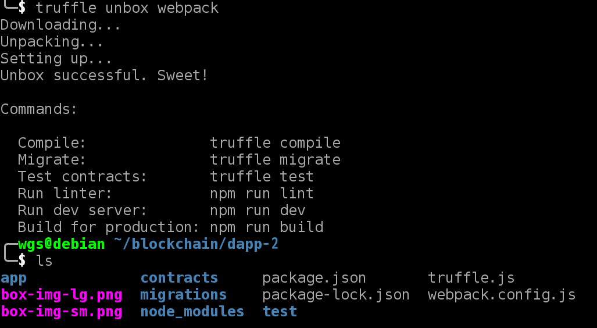
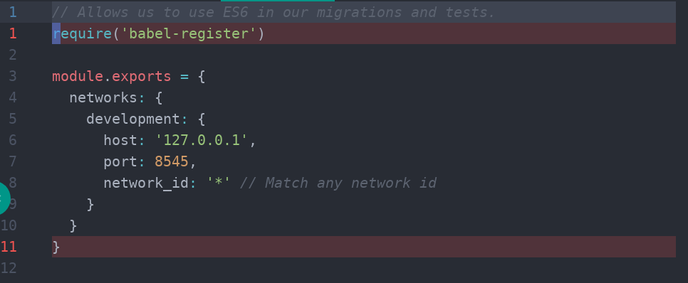
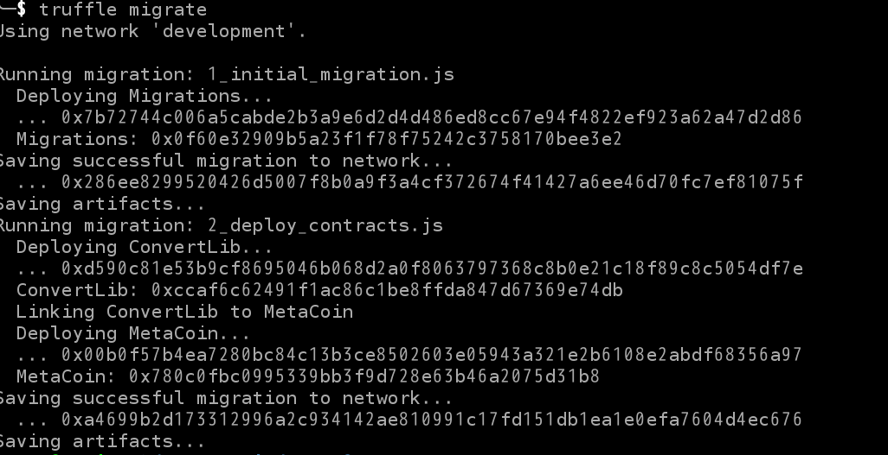
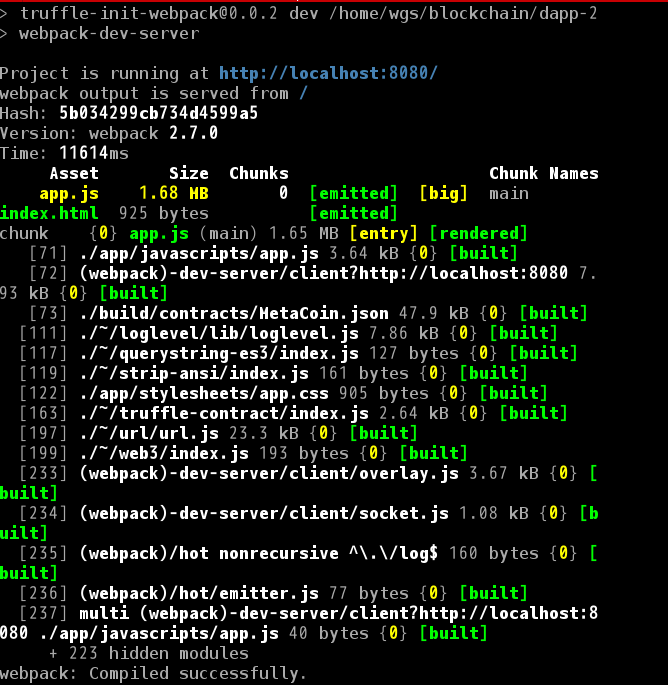
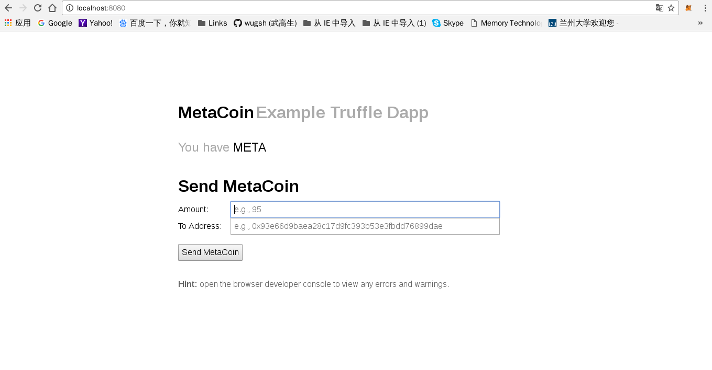
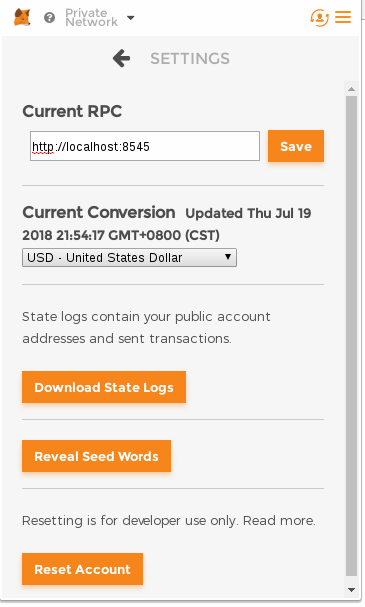

# Truffle开发以太坊DAPP

**step 1.创建一个项目**

> 1.项目初始化
>
> ```text
> $ mkdir dapp
> $ cd dapp
> $ truffle unbox webpack
> ```
>
> 执行如图：
>
> 
>
> 执行以上命令之后，文件夹内会自动生成开发所需要的目录结构：
>
> > contracts/：Solidity职能合约目录
> >
> > migrations/：部署用到的脚本
> >
> > test/：用于测试应用程序和合约的测试文件目录
> >
> > truffle.js：配置文件
> >
> > app：前端代码目录

**step 2.选择以太坊客户端**

安装Ethereum客户端来支持JSON RPC API的调用。

> thereum客户端的选择有很多，本地开发可以使用：Ganache、Ethereumjs-testrpc、以及truffle自带的Truffle Develop，只需要用其中一种就可以。
>
> 主网部署时推荐使用：Geth.

**step 3.编译和部署合约**

> 1.更改truffle.js 文件配置
>
> > 这里要注意的是：
> >
> > Ganache默认运行在7545端口;
> >
> > Ethereumjs-testrpc 默认运行在8545端口;
> >
> > Truffle Develop 默认运行在9545端口;
> >
> > 根据你选择的不同客户端，修改端口，其他代码不要动。
>
> 
>
> 2.编译合约
>
> > truffle框架里提供demo代码，我们暂时不用写新的合约，可以直接用demo进行编译和部署。
> >
> > 输入命令：
> >
> > ```text
> >  $ truffle compile
> > ```
> >
> > 编译成功的话，项目文件夹里会多一个build文件夹。
>
> 3.部署合约  
> 部署合约之前，请开启之前下载的以太坊客户端：
>
> > Ganache：在终端执行 ganache-cli 命令，以出现测试账号为成功，不要关闭，打开新的终端窗口进行下一步;
> >
> > Ethereumjs-testrpc:在终端执行 testrpc 命令，以出现测试账号为成功，不要关闭，打开新的终端窗口进行下一步;
> >
> > Truffle Develop：在终端执行 truffle develop 命令，以出现测试账号为成功，可直接在此窗口进行下一步。
> >
> > 开启客户端之后再输入命令：
> >
> > ```text
> >  $ truffle migrate
> > ```
> >
> > 执行成功，会出现以下界面：  
> > 

**step 4.测试网页与合约交互**

> 上面的合约部署成功后，我们就可以在服务器中查看效果了。执行:
>
> ```text
>   $ npm run dev
> ```
>
> 
>
> 浏览器打开[http://localhost:8080/](http://localhost:8080/) 可以看到一个demo 页面。
>
> 
>
> 这个是truffle unbox webpack后默认产生的MetaCoin合约，并生成了一个简单的界面。在这里你可以向其他地址发送MetaCoin。
>
> 发送MetaCoin会调用metamask ,所以先将metamask切换到localhost网络环境
>
> 默认端口环境只有 localhost：8545
>
> 如果你用的以太坊客户端是Ganache 或 Truffle Develop的话，就需要Custom RPC 添加 [http://localhost：7545](http://localhost：7545) 或 [http://localhost：9545](http://localhost：9545) 根据你用的客户端来设置。
>
> 

