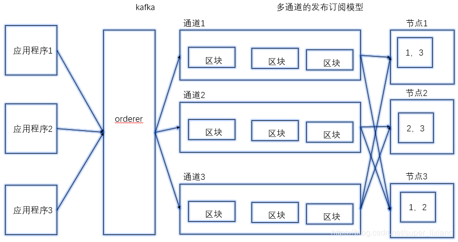

# Fabric共识机制

由于fabric是分布式的系统，因此需要共识机制来保障各个节点以相同的顺序状态保存账本，达成一致性。 在当前fabric1.4版本中，存在三种共识机制，分别是solo，kafka，etcdraft。

达成共识需要3个阶段，**交易背书，交易排序，交易验证** 

* 交易背书：模拟的
* 交易排序：确定交易顺序，最终将排序好的交易打包区块分发
* 交易验证：区块存储前要进行一下交易验证

## **orderer节点的作用**

* 交易排序
  * 目的：保证系统的最终一致性（有限状态机）
  * solo：单节点排序
  * kafka：外置的分布式消息队列
* 区块分发
  * orderer中的区块并不是最终持久化的区块
  * 是一个中间状态的区块
  * 包含了所有交易，不管是有效还是无效，都会打包传给组织的锚节点
* 多通道的数据隔离
  * 客户端可以使用某个通道，发送交易

## 1.Solo 共识模式

Solo共识模式指网络环境中只有一个排序节点，从Peer节点发送来的消息由一个排序节点进行排序和产生区块；由于排序服务只有一个排序节点为所有Peer节点服务，没有高可用性和可扩展性，不适合用于生产环境，通常用于开发和测试环境。

> Solo共识模式调用过程说明：  
> 1. Peer节点通过GPRC连接排序服务，连接成功后，发送交易信息。  
> 2. 排序服务通过Recv接口，监听Peer节点发送过来的信息，收到信息后进行数据区块处理。  
> 3. 排序服务根据收到的消息生成数据区块，并将数据区块写入账本（Ledger）中，返回处理信息。  
> 4. Peer节点通过deliver接口，获取排序服务生成的区块数据。

## 2. Kafka 共识模式

Hyperledger Fabric的核心共识算法通过Kafka集群实现，简单来说，就是通过Kafka对所有交易信息进行排序（如果系统存在多个channel，则对每个channel分别排序）。  
Kafka是一个分布式的流式信息处理平台，目标是为实时数据提供统一的、高吞吐、低延迟的性能。

> Kafka由以下几类角色构成：
>
> * Broker：消息处理节点，主要任务是接收producers发送的消息，然后写入对应的topic的partition中，并将排序后的消息发送给订阅该topic的consumers。 大量的Broker节点提高了数据吞吐量，并互相对partition数据做冗余备份（类似RAID技术）。
> * Zookeeper：为Brokers提供集群管理服务和共识算法服务（paxos算法），例如，选举leader节点处理消息并将结果同步给其它followers节点，移除故障节点以及加入新节点并将最新的网络拓扑图同步发送给所有Brokers。
> * Producer：消息生产者，应用程序通过调用Producer API将消息发送给Brokers。
> * Consumer：消息消费者，应用程序通过Consumer API订阅topic并接收处理后的消息。

Kafka将消息分类保存为多个topic，每个topic中包含多个partition，消息被连续追加写入partition中，形成目录式的结构。一个topic可以被多个consumers订阅。简单来说，partition就是一个FIFO的消息管道，一端由producer写入消息，另一端由consumer取走消息（注意，这里的取走并不会移除消息，而是移动consumer的位置指针）。

> **在Hyperledger Fabric中的Kafka实际运行逻辑如下：**  
> 1. 对于每一条链，都有一个对应的分区;  
> 2. 每个链对应一个单一的分区主题;  
> 3. 排序节点负责将来自特定链的交易（通过广播RPC接收）中继到对应的分区;  
> 4. 排序节点可以读取分区并获得在所有排序节点间达成一致的排序交易列表;  
> 5. 一个链中的交易是定时分批处理的，也就是说当一个新的批次的第一个交易进来时，开始计时;  
> 6. 当交易达到最大数量时或超时后进行批次切分，生成新的区块;  
> 7. 定时交易是另一个交易，由上面描述的定时器生成;  
> 8. 每个排序节点为每个链维护一个本地日志，生成的区块保存在本地账本中;  
> 9. 交易区块通过分发RPC返回客户端  
> 10. 当发生崩溃时，可以利用不同的排序节点分发区块，因为所有的排序节点都维护有本地日志。

## 3. Etcdraft 共识模式

Raft 是 v1.4.1 中引入的，它是一种基于 etcd 的崩溃容错（CFT）排序服务。Raft 遵循 “领导者和追随者” 模型，其中领导者在通道中的orderer节点之间动态选出（这个节点集合称为“consenter set”），该领导者将消息复制到跟随者节点。由于系统可以承受节点（包括领导节点）的丢失，只要剩下大多数排序节点（即所谓的“仲裁”），Raft就被称为“崩溃容错”（CFT）。换句话说，如果一个通道中有三个节点，它可以承受一个节点的丢失（剩下两个节点）。

### 3.1 raft相关概念

> * 日志条目：Raft排序服务中的主要工作单元是“日志条目”，这些条目的完整序列称为“日志”。如果成员的多数（法定人数，换言之）成员到条目及其顺序达成一致，我们认为日志是一致的。
> * Consenter设置：排序节点主动参与给定信道的共识机制并接收信道的复制日志。这可以是所有可用节点（在单个群集中或在对系统通道有贡献的多个群集中），或者是这些节点的子集。
> * 有限状态机（FSM）：Raft中的每个排序节点都有一个FSM，它们共同用于确保各个排序节点中的日志序列是确定性的（以相同的顺序编写）。
> * 法定人数：描述需要确认提案的最少数量的同意者，以便可以提交交易。对于每个consenter集，这是 大多数节点。在具有五个节点的群集中，必须有三个节点才能存在仲裁。如果由于任何原因导致法定数量的节点不可用，则orderer将无法用于通道上的读取和写入操作，并且不能提交新日志。
> * Leader：Leader负责提取新的日志条目，将它们复制到跟随者订购节点，以及管理何时认为条目已提交。这不是特殊类型orderer人。在情况决定的情况下，这只是orderer在某些时候可能拥有的角色，而不是其他角色。
> * Follower：Follower从Leader那里接收日志并确定性地复制它们，确保日志保持一致。Follower也会收到来自Leader的“心跳”信息。如果Leader停止在可配置的时间内发送这些消息，则追将发起选举，其中一个Follower将被选为新Leader。

### 3.2 raft在交易中的流程

每个通道都在Raft协议的单独实例上运行，这允许每个实例选择不同的leader。还允许集群由不同组织控制的排序节点组成的用例中进一步分散服务。虽然所有Raft节点必须是系统通道的一部分，但它们不一定必须是所有应用程序通道的一部分。通道创建者（和通道管理员）可以选择可用orderer的子集，并根据需要添加或删除orderer（一次只能添加或删除一个节点）。

在Raft中，交易（提案或配置更新的形式）由接收交易的orderer节点自动路由到该信道的当前leader。这意味着peer和应用程序不需要知道leader是谁。只有orderer节点需要知道。

### 3.3 raft节点选举日志传输

raft节点始终处于以下三种状态之一：follower，candidate或leader。所有节点最初都是follower。在这种状态下，他们可以接受来自leader的日志条目（如果已经当选），或者为leader投票。如果在设定的时间内没有收到日志条目或心跳（例如，五秒），则节点会自我提升到candidate状态。在候选状态中，节点请求来自其他节点的投票。如果候选人获得法定数量的选票，则将其提升为leader。leader接受新的日志条目并将其复制给follower。

虽然可以无限期地保留所有日志，但为了节省磁盘空间，Raft使用一个名为“snapshotting”的进程，用户可以在其中定义将在日志中保留多少字节的数据。每个快照将包含一定数量的块）。

