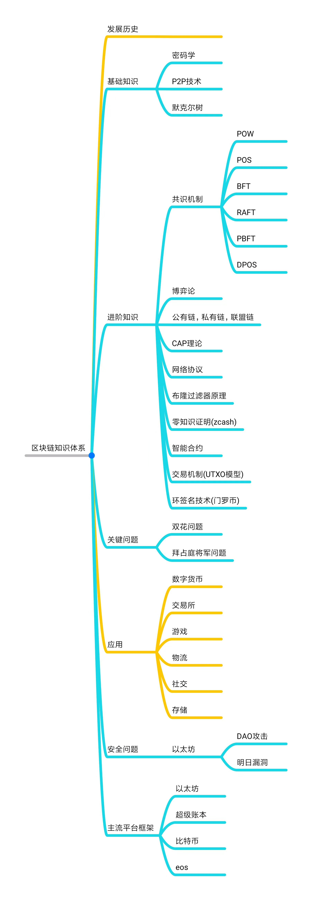

# 区块链之基础知识

### 基本概念

**区块链**

> 区块链是分布式数据存储、点对点传输、共识机制、加密算法等计算机技术的新型应用模式。所谓共识机制是区块链系统中实现不同节点之间建立信任、获取权益的数学算法。
>
> 区块链（Blockchain）是比特币的一个重要概念，它本质上是一个去中心化的数据库，同时作为比特币的底层技术。区块链是一串使用密码学方法相关联产生的数据块，每一个数据块中包含了一次比特币网络交易的信息，用于验证其信息的有效性（防伪）和生成下一个区块。

**区块**

> 区块作为区块链的基本结构单位，有包含元数据的取块头和包含交易数据的区块主体组成。
>
> 区块头包含三组元数据：
>
> > 1.用于连接前面的区块、索引字父区块哈希值的数据；
> >
> > 2.挖矿难度、Nonce（随机数，用于工作量证明算法的计数器）、时间戳；
> >
> > 3.能够总结并快速归纳校验区块中的所有交易数据的Merkle\(默克尔\)树根数据。

**哈希算法**

  

**Merkle树结构**

  

**公钥加密系统**

> 公钥加密系统是非对称加密机制，使用一对密钥（一个公钥和一个私钥）来保护加密数据。
>
> 公钥加密数据，并相应地解密数据，公钥可以对外公布，但是私钥必须秘密保存；使用某联系人公钥加密的邮件，只有该联系人可以用自己的私钥解密并阅读；
>
> 不可能用公钥来创建私钥并代替私钥的功能，因此，任何人使用公钥能加密信息，但是不能用公钥解密该信息；只有拥有与公钥相配对的私钥的人才掌有解密信息的权利。

**点对点网络**

> 对等式网络（peer-to-peer， 简称P2P），又称点对点技术，是无中心服务器、依靠用户群（peers）交换信息的互联网体系，它的作用在于，减低以往网路传输中的节点，以降低资料遗失的风险。与有中心服务器的中央网络系统不同，对等网络的每个用户端既是一个节点，也有服务器的功能，任何一个节点无法直接找到其他节点，必须依靠其户群进行信息交流。

**矿工**

> 负责产生区块的人。

**挖矿机**

> 负责产生区块的机器。

**工作量证明**

> 矿工们总是在竞争解决一些数学问题。第一个解出答案的\(算出下一个区块\)将获得以太币作为奖励。然后所有节点都更新自己的区块链。所有想要算出下一个区块的矿工都有与其他节点保持同步，并且维护同一个区块链的动力，因此整个网络总是能达成共识

**以太坊**

> 以太坊\(Ethereum）是一个开源的有智能合约功能的公共区块链平台。通过其专用加密货币以太币（Ether，又称“以太币”）提供去中心化的虚拟机（称为“以太虚拟机”Ethereum Virtual Machine）来处理点对点合约。

**以太币**

> 以太坊区块链上的代币称为以太币（Ether），代码为ETH，可在许多加密货币的外汇市场上交易，它也是以太坊上用来支付交易手续费和运算服务的媒介

**Gas. \(汽油\)**

> 在以太坊上执行程序以及保存数据都要消耗一定量的以太币，Gas是以太币转换而成。这个机制用来保证效率。

**Dapp\(去中心化应用\)**

> Dapp（去中心化应用程序）是一种开源的应用程序，自动运行，将其数据存储在区块链上，以密码令牌的形式激励，并以显示有价值证明的协议进行操作。

**testrpc**

> testrpc可以在启动时帮你创建一堆存有资金的测试账户。它的运行速度也更快因此更适合开发和测试。你可以从testrpc起步，然后随着合约慢慢成型，转移到geth创建的测试网络上 - 启动方法很简单，只需要指定一个networkid：geth --networkid "12345"。

**Solidity**

> Solidity 是一个面向合约的高级语言，其语法类似于JavaScript 。是运行在以太坊虚拟机中的代码。
>
> Solidity 是静态类型的编程语言，编译期间会检查其数据类型。支持继承、类和复杂的用户定义类型。

**web3.js API**

> 当Solidity合约编译好并且发送到网络上之后，你可以使用以太坊的web3.js JavaScript API来调用它，构建能与之交互的web应用。

### 区块链原理

> 如果把区块链作为一个状态机，则每次交易就是试图改变一次状态，而每次共识生成的区块，就是参与者对于区块中所有交易内容导致状态改变的结果进行确认。
>
> > 交易（Transaction）：一次操作，导致账本状态的一次改变，如添加一条记录。
> >
> > 区块（Block）：记录一段时间内发生的交易和状态结果，是对当前账本状态的一次共识。
> >
> > 链（Chain）：由一个个区块按照发生顺序串联而成，是整个状态变化的日志记录。

### 区块链的技术架构

> 首先是“数据层”，封装了底层数据区块的链式结构，以及相关的非对称公私钥数据加密技术和时间戳等技术，这是整个区块链技术中最底层的数据结构。这些技术是构建全球金融系统的基础，数十年的使用证明了它非常安全的可靠性。而区块链，正式巧妙地把这些技术结合在了一起。
>
> 其次是“网络层”，包括P2P组网机制、数据传播机制和数据验证机制等。P2P组网技术早期应用在BT这类P2P下载软件中，这就意味着区块链具有自动组网功能。
>
> 第三层“共识层”，封装了网络节点的各类共识机制算法。共识机制算法是区块链的核心技术，因为这决定了到底是谁来进行记账，而记账决定方式将会影响整个系统的安全性和可靠性。目前已经出现了十余种共识机制算法，其中比较最为知名的有工作量证明机制（PoW，Proof of Work）、权益证明机制（PoS，Proof ofStake）、股份授权证明机制（DPoS，Delegated ProofofStake）等。数据层、网络层、共识层是构建区块链技术的必要元素，缺少任何一层都将不能称之为真正意义上的区块链技术。
>
> 第四层“激励层”，将经济因素集成到区块链技术体系中来，包括经济激励的发行机制和分配机制等，主要出现在公有链当中。在公有链中必须激励遵守规则参与记账的节点，并且惩罚不遵守规则的节点，才能让整个系统朝着良性循环的方向发展。而在私有链当中，则不一定需要进行激励，因为参与记账的节点往往是在链外完成了博弈，通过强制力或自愿来要求参与记账。
>
> 第五层“合约层”，封装各类脚本、算法和智能合约，是区块链可编程特性的基础。比特币本身就具有简单脚本的编写功能，而以太坊极大的强化了编程语言协议，理论上可以编写实现任何功能的应用。如果把比特币看成是全球账本的话，以太坊可以看作是一台“全球计算机”，任何人都可以上传和执行任意的应用程序，并且程序的有效执行能得到保证。
>
> 第六层“应用层”，封装了区块链的各种应用场景和案例，比如搭建在以太坊上的各类区块链应用即部署在应用层，而未来的可编程金融和可编程社会也将会是搭建在应用层。
>
> 激励层、合约层和应用层不是每个区块链应用的必要因素，一些区块链应用并不完整的包含后三层结构。

### 区块链的特征

> **1.去中心化：**  
> 由于使用分布式核算和存储，不存在中心化的硬件或管理机构，任意节点的权利和义务都是均等的，系统中的数据块由整个系统中具有维护功能的节点来共同维护。  
> 得益于区块链的去中心化特征，比特币也拥有去中心化的特征 。
>
> **2.开放性：**  
> 系统是开放的，除了交易各方的私有信息被加密外，区块链的数据对所有人公开，任何人都可以通过公开的接口查询区块链数据和开发相关应用，因此整个系统信息高度透明。
>
> **3.自治性：**  
> 区块链采用基于协商一致的规范和协议（比如一套公开透明的算法）使得整个系统中的所有节点能够在去信任的环境自由安全的交换数据，使得对“人”的信任改成了对机器的信任，任何人为的干预不起作用。
>
> **4.信息不可篡改：**  
> 一旦信息经过验证并添加至区块链，就会永久的存储起来，除非能够同时控制住系统中超过51%的节点，否则单个节点上对数据库的修改是无效的，因此区块链的数据稳定性和可靠性极高。
>
> **5.匿名性：**  
> 由于节点之间的交换遵循固定的算法，其数据交互是无需信任的（区块链中的程序规则会自行判断活动是否有效），因此交易对手无须通过公开身份的方式让对方对自己产生信任，对信用的累积非常有帮助。

### **区块链知识体系**

## 应用场景

### 主要场景：

**▪ 智能合约 ▪ 证券交易 ▪ 电子商务 ▪ 物联网 ▪ 社交通讯 ▪ 文件存储 ▪ 存在性证明 ▪ 身份验证 ▪ 股权众筹**

